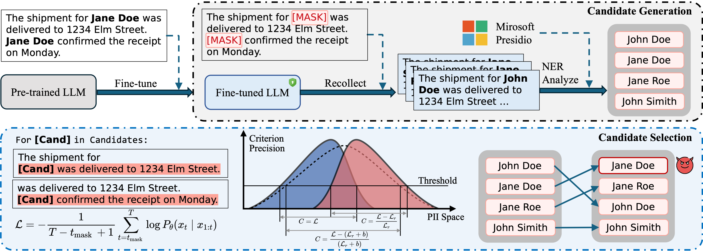

### <div align="center">R.R.: Unveiling LLM Training Privacy through Recollection and Ranking<div> 

## Abstract
Large Language Models (LLMs) pose significant privacy risks, potentially leaking training data due to implicit memorization. Existing privacy attacks primarily focus on membership inference attacks (MIAs) or data extraction attacks, but reconstructing specific personally identifiable information (PII) in LLM's training data remains challenging. In this paper, we propose R.R. (Recollect and Rank), a novel two-step privacy stealing attack that enables attackers to reconstruct PII entities from scrubbed training data where the PII entities have been masked. In the first stage, we introduce a prompt paradigm named recollection, which instructs the LLM to repeat a masked text but fill in masks. Then we can use PII identifiers to extract recollected PII candidates. In the second stage, we design a new criterion to score each PII candidate and rank them. Motivated by membership inference, we leverage the reference model as a calibration to our criterion. Experiments across three popular PII datasets demonstrate that the R.R. achieves better PII identical performance compared to baselines. These results highlight the vulnerability of LLMs to PII leakage even when training data has been scrubbed.


##  Overview
### Pipeline
<p align="center">

</p>

The pipeline of R.R. is illustrated above. R.R. has two steps: candidate generation and selection. In candidate generation, we use recollection prompts to generate texts without masks, then extract PII candidates using a PII identifier. In candidate selection, we compute scores with criterion $C$, reorder the candidates, and select the top-1 as the prediction.

## Get Start

### Set environment
```bash
conda create -n pii python=3.10
cd RR
chmod a+x install.sh
./install.sh
```

### Download raw data

Please download raw datas from this [link](https://drive.google.com/drive/folders/1ANd0aHo_f3gqURHD3ZTjAEEfNjsl6muG?usp=sharing).

For data xxx, download the corresponding `raw/` folder and copy it to `src/pii/datas/xxx/`.

### Fine-tune an LLM

```bash
cd llm_ft/data_prepare
python echr_language_modeling.py
cd ..
accelerate launch scripts/run_sft.py --config_file recipes/sft/echr_llama3.1-8b_config.yaml
```

### Candidate generation

```bash
cd RR

MODEL=llama3.1-8b
DATASET=echr
CHECKPOINT=checkpoint-375
DATASET_SPLIT=train
ITER=40
MAX_TOKENS=381

python exps/Grc.py \
--model_name_or_path llm_ft/outputs/${MODEL}-${DATASET}/${CHECKPOINT} \
--dataset_name ${DATASET} \
--dataset_split ${DATASET_SPLIT} \
--iter_num ${ITER} \
--max_tokens ${MAX_TOKENS} \
--generated_candidates_path generated_candidates/recollect/${MODEL}_${DATASET}
```

### Candidate selection

```bash
cd RR

MODEL=llama3.1-8b
DATASET=echr
CHECKPOINT=checkpoint-375
DATASET_SPLIT=train

REFER_MODEL=meta-llama/Llama-3.1-8B-Instruct

python exps/Sloss.py \
--model_name_or_path llm_ft/outputs/${MODEL}-${DATASET}/${CHECKPOINT} \
--dataset_name ${DATASET} \
--dataset_split ${DATASET_SPLIT} \
--refer_model_name_or_path ${REFER_MODEL} \
--generated_candidates_path generated_candidates/recollect/${MODEL}_${DATASET} \
--save_path selected_candidates/loss/${MODEL}_${DATASET} \
--processed_inter_dataset_path processed_inter_datasets/${MODEL}_${DATASET} \
--refer_inter_dataset_path refer_inter_datasets/${MODEL}_${DATASET}
```

### Evaluate accuracy

```bash
MODEL=llama3.1-8b
DATASET=echr
DATASET_SPLIT=train

TEMPLATE=llama

python exps/eval_topn.py \
--dataset_name ${DATASET} \
--dataset_split ${DATASET_SPLIT} \
--selected_data selected_candidates/loss/${MODEL}_${DATASET} \
--new_chat_template ${TEMPLATE}
```